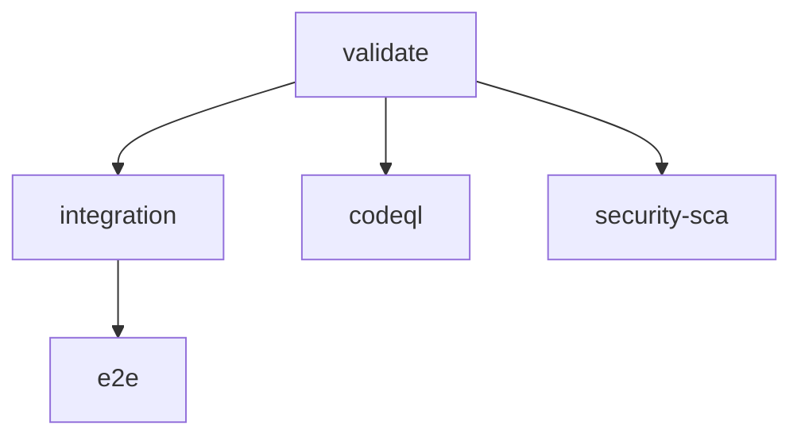

# Architecture Map

## Package Graph

- `@repo/schema` -> no internal runtime dependencies
- `@repo/telemetry` -> no internal runtime dependencies
- `@repo/database` -> `@repo/telemetry`
- `@repo/auth` -> `@repo/database`
- `@repo/tenancy` -> no internal runtime dependencies
- `@repo/billing` -> provider interfaces only
- `@repo/api` -> `@repo/auth`, `@repo/database`, `@repo/schema`, `@repo/tenancy`, `@repo/telemetry`
- `@repo/web` -> `@repo/api` types over HTTP only
- `@repo/docs` -> docs-only app, no internal runtime package dependencies
- `tests/e2e` -> `apps/api` over HTTP only

## CI Graph

## Test Lanes

| Lane | Command | Use it for | Do not put here |
| --- | --- | --- | --- |
| Unit | `pnpm test` | Fast in-process tests for packages and the exported Hono app | Postgres-backed integration checks |
| Integration | `pnpm test:integration` | DB-backed tests that require `DATABASE_URL` and migrations, including tenant isolation checks | Pure unit tests or Playwright flows |
| E2E | `pnpm test:e2e` | Playwright smoke coverage against a running API | White-box package tests or direct schema checks |

## Common Placement Rules

- Keep `/health` in the unit lane via `app.request('/health')`.
- Keep Drizzle schema and migration validation in `@repo/database`.
- Keep tenant resolution centralized in `@repo/tenancy` and API context, not duplicated across procedures.
- Keep e2e tests black-box; they should not import runtime workspace code.
